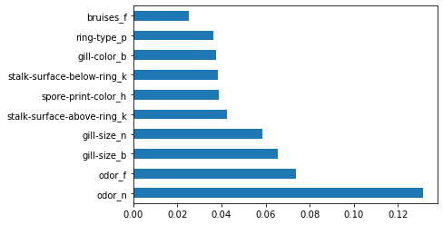

# Feature Importance
<p align="center"></p>

Genellikle bir makine öğrenmesi projesine başlarken çalışacağınız veri istediğiniz formatta ve modele uygulanmaya hazır bir şekilde değildir. Farklı uzantılarda ve yapılarda olabilir. (CSV, JSON, Excel veya DB etc.) Ayrıca veriseti kendi içerisinde eksik, anormal veya gereksiz bilgiler de içeriyor olabilir. Aynı zamanda modelinizde kullanacağınız veriye ön hazırlıklar yapmanız gerekebilir, örnek vermek gerekirse ölçeklendirme veya normalleştirme sayılabilir.

Her şeye rağmen bu işlemleri tamamladığınızda dahi modelinizin iyi bir performans göstermesi için boyutsallığının azaltılması ve güçlü ilişkilere sahip parametrelerin, performansı kötü etkileyecek diğer parametrelerden ayrılması gerekir. Çünkü bu öznitelikler (features) modele bir bilgi getirmiyor olabilirler.

Bu yüzden bir veri bilimci veya makine öğrenmesi mühendisinin en önemli yetkinlikleri aslında bu verinin önişlemlerini gerçekten iyi yapmasından geçmektedir. Bu seride güncel olarak kullanılan Feature Selection yani öznitelik seçimlerinde kullanılan etkili metodları inceliyor olacağız. Teoride daha fazla öznitelik eklenmesi modelin gelişimi için daha iyidir fakat pratikte bunun tam tersi geçerlidir. Bu önerme aslında hem doğru hem de yanlıştır, çünkü modele getirdiğiniz her özellik bilgi taşıyan ve önemli bir parametre olması gerekir. Burada optimum değeri yakalamak önemli, tabii ki curse of dimensionality yani boyutsallığın laneti konusuna da dikkat etmemiz gerekir.

Pekala boyut düşürmenin veya öznitelik azaltmanın yararları nedir:
* Daha yüksek doğruluk oranı
* Overfitting probleminin önüne geçmek.
* Model eğitim süresinin kısaltılması.
* Daha etkin bir görselleştirme
* Daha açıklanabilir bir model.

Burada kullanacağımız veri seti "Mushroom Classification" yani "Mantar Sınıflandırma" veri seti olacak. Kullanacağımız kütüphaneler tahmin edebileceğiniz gibi:
* Pandas
* Numpy
* Matplotlib
* Seaborn
* Sklearn 

## Imports

```python
import pandas as pd 
from sklearn.preprocessing import LabelEncoder
from sklearn.preprocessing import StandardScaler
from sklearn.model_selection import train_test_split
```

```python
data = pd.read_csv("mushrooms.csv")
data.head()
```

## Dataset Prep.

Veri setini ve başlangıç parametrelerimizi hazırlayalım. Burada verisetimizdeki her bir kolonu one_hot_encoding yöntemiyle encode edeceğim.

[https://www.kaggle.com/uciml/mushroom-classification](https://www.kaggle.com/uciml/mushroom-classification)

```python
X = data.drop(['class'], axis=1)
y = data['class']

X_encoded = pd.get_dummies(X, prefix_sep="_")
y_encoded = LabelEncoder().fit_transform(y)
X_scaled = StandardScaler().fit_transform(X_encoded)

X_train, X_test, y_train, y_test = train_test_split(X_scaled, y_encoded, test_size = 0.30, random_state=101)
```

## Feature Selection Techniques

### Feature Importance

Karar ağaçları çeşitli özniteliklerin önem derecelerini sıralamak için kullanılabilir. Karar ağaçlarındaki dallanma bildiğiniz gibi özniteliklerin sınıflandırıcılığıyla belirlenir. Bu yüzden daha çok kullanılan nodelar daha yüksek öneme sahip olabilirler. 

```python
import time
from sklearn.metrics import classification_report,confusion_matrix
from sklearn.ensemble import RandomForestClassifier
```

```python
start = time.process_time()

model = RandomForestClassifier(n_estimators=700).fit(X_train, y_train)

print(time.process_time() - start)

preds = model.predict(X_test)

print(confusion_matrix(y_test, preds))
print(classification_report(y_test, preds))
```

2 saniye gibi bir sürede modelin eğitimi tamamlandı.

```python
1.78125
[[1274    0]
 [   0 1164]]
              precision    recall  f1-score   support

           0       1.00      1.00      1.00      1274
           1       1.00      1.00      1.00      1164

    accuracy                           1.00      2438
   macro avg       1.00      1.00      1.00      2438
weighted avg       1.00      1.00      1.00      2438
```

Tam bir başarı oranına sahibiz fakat burada bakacağımız konu aslında hangi niteliklerin ne kadar önemli olduğu. Bu yüzden feature importance metoduyla eğitilmiş modelin en önemli olduğu 10 parametreyi görselleştiriyorum.

```python
import matplotlib.pyplot as plt
from matplotlib.pyplot import figure
```

```python
feature_imp = pd.Series(model.feature_importances_, index= X_encoded.columns)
feature_imp.nlargest(10).plot(kind='barh')
```



Şimdi tüm kolonları kullanmak yerine sadece önemli olarak gördüğüm 4 parametreyle eğiteceğim.

```python
best_feat = feature_imp.nlargest(4).index.to_list()

X_reduced = X_encoded[feature_imp.nlargest(4).index]
Xr_scaled = StandardScaler().fit_transform(X_reduced)

Xr_train, Xr_test, yr_train, yr_test = train_test_split(Xr_scaled, y, test_size = 0.30, 
                                                        random_state = 101)

start = time.process_time()
rmodel = RandomForestClassifier(n_estimators=700).fit(Xr_train,yr_train)
print(time.process_time() - start)

rpred = rmodel.predict(Xr_test)
print(confusion_matrix(yr_test, rpred))
print(classification_report(yr_test, rpred))
```

```python
0.84375
[[1248   26]
 [  53 1111]]
              precision    recall  f1-score   support

           e       0.96      0.98      0.97      1274
           p       0.98      0.95      0.97      1164

    accuracy                           0.97      2438
   macro avg       0.97      0.97      0.97      2438
weighted avg       0.97      0.97      0.97      2438
```

Çok açık bir şekilde görebiliriz ki, eğitim süresi yarı yarıya inerken accuracy'den çok az kaybettik. Aslına bakarsanız bu çok küçük bir veriseti kazancımız 1 saniye kadar fakat bunu milyonlarca satıra sahip bir verisetiyle saatlerce eğittiğiniz bir model olduğunu düşünürseniz kesinlikle gireceğiniz bir tradeoff olacaktır.

Bir sonraki derste Recursive Feature Elimination (RFE) tekniğini göreceğiz. 

İyi çalışmalar dilerim.
